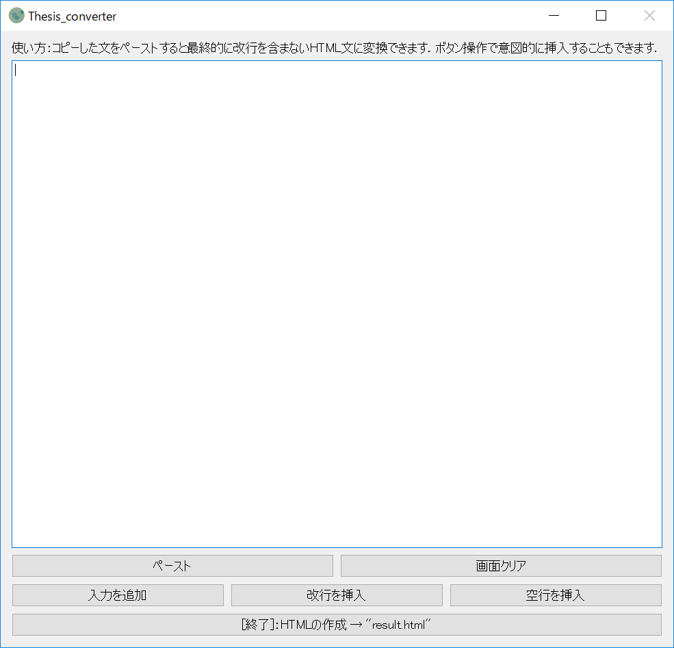
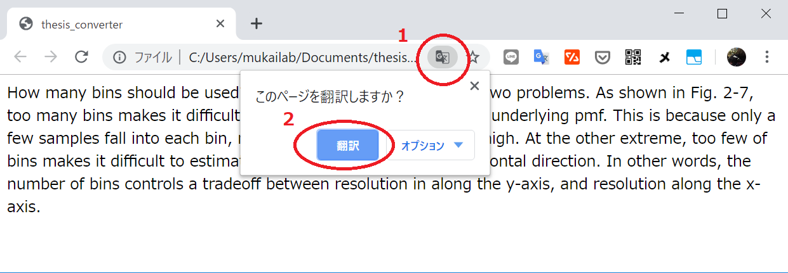

# 英語論文翻訳のツール
英文の論文を読んでいる際に，確認用に論文をGoogle翻訳に投げたい時，pdfファイルの内容をそのままコピペすると改行があってうまく翻訳されませんよね．  
そんな問題を解決するツールを作りました．  
このツールを使い，訳したい論文の内容をコピペすると最終的にHTMLファイルが生成されます．  
これをChromeで開くと簡単にGoogle翻訳に投げることができます．  
pythonでPyQt5とpyperclipを入れて実行するか，exeファイルが[release](https://github.com/yagijin/Thesis_Converter/releases)にあるのでそれを使ってください．

# GUI
GUIはこんな感じです．  
ペーストでクリップボード上の文章をペーストできます．`入力を追加`で，表示されている文章を入力できます．`改行を挿入`や`空行を挿入`で段落などで任意で改行や空行を入れることができます．HTMLの要素を直接記入しても大丈夫です．最終的に`HTMLの作成`を押すと`result.html`が作成されプログラムが終了します．  
※追記はできません，もう一度実行するとresult.htmlの中身が上書きされます．



HTMLをChromeで開いて以下のように変換してください．  



# memo
実行可能ファイル生成時のコマンド  
``` pyinstaller thesis_converter.py --onefile --noconsole --icon=icon.ico ```  
これを実行したあとにできたspecファイルのexe= の前の行に  
``` a.datas += [('icon.png','.\\icon.png', 'Data')] ```  
と書き込んで，以下を実行すると実行可能ファイルにicon.pngのデータを含められる．  
``` pyinstaller thesis_converter.spec ```  